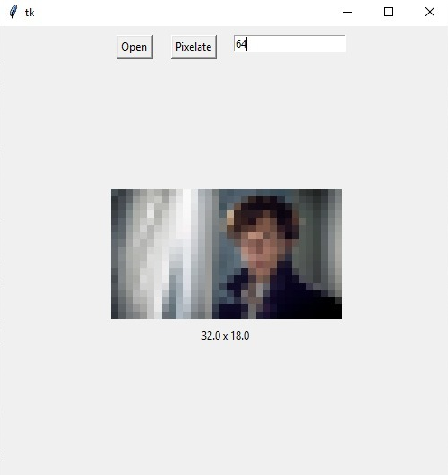

# Pixelator

This is a basic project that takes an image and decreases image's pixel size by calculating average values of RGB's of each pixel around and make them the same pixel. 

If the input 64, it means the function will make every 64 pixel the same; which means a 2-dimensinal (8,8) cube of pixels. 

If there are pixels that stay outside after we we found all these cubes, the function won't do anything for them. For example:

We have an image with size of (220 x 100)

If we give 64 as input, the program will turn every 8x8 cube of pixels to a single pixel.

220 / 8 = 27 * 8 + 4 (4 pixels remains the same)

100 / 8 = 25 * 8 (no pixel outside cubes)

27 * 25 = 675 (total amount of pixels of new image)

We can also call this proccess a kind of bluring.

# 

